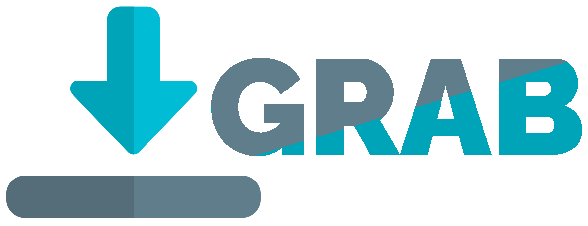
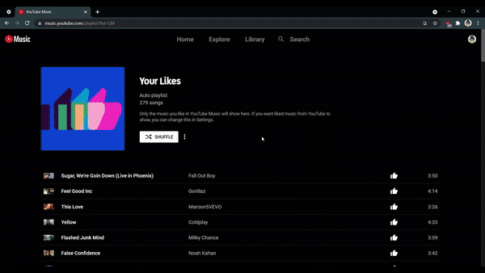

<p align="center">
	
</p>

Grab is an open-source python3 based project that lets you download
all your liked songs from YouTube Music.

## Dependencies

-  [ffmpeg](https://www.ffmpeg.org/)
-  [python3](https://www.python.org/)

## Installation
 
```
git clone 
cd 
pip install beautifulsoup4
```

## Usage

<p align="center">
	
</p>

- Go to your liked songs page in youtube music

- Press `Ctrl + Shift + I` to open Developer tools and copy the HTML of the page as shown.. alternatively, you can see a better, more 
detailed version [here]()

- Paste this in the `music.youtube.com_playlist_list=LM.html` file and save it

- Then, simply run
```
$ python grab.py
```

- All your downloads will be saved in the `Downloads` folder in this same working directory


## Bug reports and technical discussions

-  To report a *bug* in the software or to request *a simple enhancement* go to [Github Issues](https://github.com/arduino/Arduino/issues)
-  For detailed discussions, feel free to email me at DarkKnight450@protonmail.com


## Credits

Grab is an open source project, supported by many.
Arduino uses
[ffmpeg](https://github.com/FFmpeg/FFmpeg) and 
[youtube-dl](https://github.com/ytdl-org/youtube-dl).

These are some really awesome projects and **I do not own any of them.**
Make sure to give the original authors credit.
